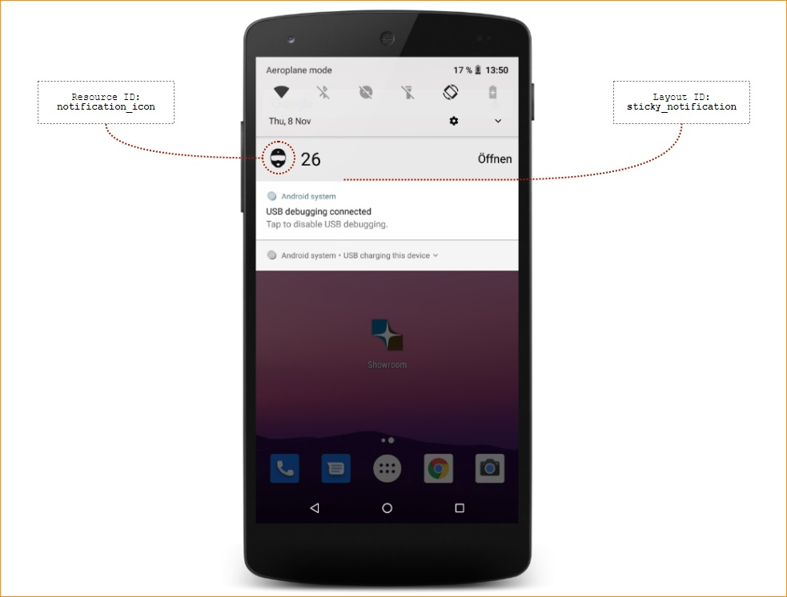

# Cordova Step Counter Plugin

Uses the step counter service APIs introduced in Android 4.4 KitKat to, you guessed it, count the number of steps whomever is holding the device running your app takes.

## Anatomy of notification layout:



## Using
Create a new Cordova Project

    $ cordova create hello com.example.helloapp Hello
    
Install the plugin

    $ cd hello
    $ cordova plugin add https://github.com/DigitalsunrayMedia/cordova-plugin-stepcounter.git
    

Edit `www/js/index.html` and add the following code inside `onDeviceReady`

```js
    var success = function(message) {
        alert(message);
    }

    var failure = function() {
        alert("Error calling CordovaStepCounter Plugin");
    }

    // Start the step counter
    // startingOffset will be added to the total steps counted in this session.
    // ie. say you have already recorded 150 steps for a certain activity, then
    // the step counter records 50. The getStepCount method will then return 200.
    var startingOffset = 0;
    stepcounter.start(startingOffset, success, failure);

    // Stop the step counter
    stepcounter.stop(success, failure);

    // Get the amount of steps for today (or -1 if it no data given)
    stepcounter.getTodayStepCount(success, failure);
    
    // Get the amount of steps since the service is started (it is actually reseted to 0 when the service is killed by the system)
    stepcounter.getStepCount(success, failure);

    // Returns true/false if Android device is running >API level 19 && has the step counter API available
    stepcounter.deviceCanCountSteps(success, failure);

    // Get the step history (JavaScript object)
    // sample result :
    //{
    //  "2015-01-01":{"offset": 123, "steps": 456},
    //  "2015-01-02":{"offset": 579, "steps": 789}
    //  ...
    //}
    stepcounter.getHistory(
        function(historyData){
            success(historyData);
        },
        failure
    );

```

Install Android platform

    cordova platform add android
    
Run the code

    cordova run
    
    
## Changes in 0.0.10
 - Replaced: Legacy background service with a foreground service (In order to tackle the Android 8.0 + background execution limits)

## Changes in 0.0.4

 - Added : Re-integrated support for getStepCount which return the step counted since app is started
 - Added : Method getTodayStepsCount for an agregated steps count for all a day (uses offset and history to calculate)
 - Fixed : Issue with phone rebooting in a middle of a day (causes negative steps for the day, due to step < offset) 

## Changes in 0.0.3

 - getHistory() and getStepCount() return parsed JSON objects.

## Changes in 0.0.2

 - The StepCounterService is now automatically relaunched when killed (and after one hour for some 4.4.2 START_STICKY Service problem).
 - The StepCounterService should be automatically launched on device boot (using StepCounterBootReceiver)

All the step counter data are saved in the "UserData" SharedPrefs, with the "pedometerData" key so we keep the step counting history JSON formatted ("day": {"offset": XXX,"steps": YYY}
A new js function (for cordova) called getHistory() has been added to access the JSON formatted data containing step count history


## Compatibility

This will only work on Android devices running 4.4 (KitKat) or higher, and that have a step counter sensor. This includes Google's Nexus line of handsets, and potentially some others.

Use stepcounter.deviceCanCountSteps() to see if a device meets these requirements before trying to use it any further.

## Here be dragons

The quality, usefulness and functionality of this code is in no way guaranteed.
This is far from production ready stuff you're looking at, and definitely has a few hairy parts that need combing over.
If you'd like to help, I'd love to hear from you!

## More Info

For more information on setting up Cordova see [the documentation](http://cordova.apache.org/docs/en/4.0.0/guide_cli_index.md.html#The%20Command-Line%20Interface)
For more info on plugins see the [Plugin Development Guide](http://cordova.apache.org/docs/en/4.0.0/guide_hybrid_plugins_index.md.html#Plugin%20Development%20Guide)
